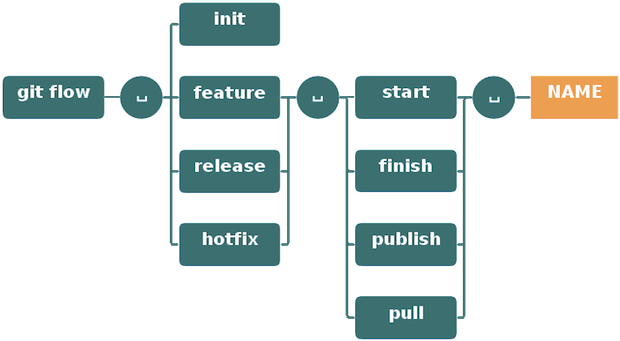
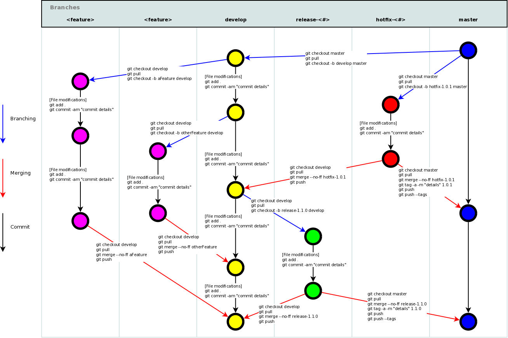

গিট এবং গিট ফ্লো চিট শীট [](https://github.com/sindresorhus/awesome)
===============
<hr>
<p align="center">
    
</p>


<hr>

### সূচিপত্র
* [সেট আপ](#সেট-আপ)
* [কনফিগারেশন ফাইল](#কনফিগারেশন-ফাইল)
* [তৈরী করা](#তৈরী-করা)
* [লোকালি পরিবর্তন করা](#লোকালি-পরিবর্তন-করা)
* [অনুসন্ধান](#অনুসন্ধান)
* [কমিট ইতিহাস](#কমিট-ইতিহাস)
* [সড়ানো বা নাম পরিবর্তন](#সড়ানো-বা-নাম-পরিবর্তন)
* [ব্রাঞ্চ এবং ট্যাগ](#ব্রাঞ্চ-এবং-ট্যাগ)
* [আপডেট এবং প্রকাশ](#আপডেট-এবং-প্রকাশ)
* [মার্জ এবং রিবেস](#মার্জ-এবং-রিবেস)
* [আনডো](#আনডো)
* [গিট ফ্লো](#গিট-ফ্লো)


<hr>

## সেট আপ

##### বর্তমান কনফিগারেশন দেখুন:
```
$ git config --list
```
##### রিপোজিটরি কনফিগারেশন দেখুন:
```
$ git config --local --list
```

##### গ্লোবাল কনফিগারেশন দেখুন:
```
$ git config --global --list
```

##### সিস্টেম কনফিগারেশন দেখুন:
```
$ git config --system --list
```

##### সংস্করণকৃত ইতিহাস পর্যালোচনা করার সময় এবং কৃতিত্বের জন্য সনাক্তযোগ্য একটি নাম সেট করুন:
```
$ git config --global user.name "[firstname lastname]"
```

##### একটি ইমেল ঠিকানা সেট করুন যা প্রতিটি ইতিহাস চিহ্নিতকারীর সাথে যুক্ত হবে:
```
$ git config --global user.email "[valid-email]"
```

##### সহজে পর্যালোচনার জন্য গিটের মধ্যে স্বয়ংক্রিয় কমান্ড লাইনের রঙ সেট করুন:
```
$ git config --global color.ui auto
```

##### কমিটের জন্য গ্লোবাল এডিটর সেট করুন:
```
$ git config --global core.editor vi
```

<hr>

## কনফিগারেশন ফাইল

##### রিপোজিটরি স্পেসিফিক কনফিগারেশন ফাইল [--local]:
```
<repo>/.git/config
```

##### ইউজার স্পেসিফিক কনফিগারেশন ফাইল [--global]:
```
~/.gitconfig
```

##### সিস্টেম-ওয়াইজ কনফিগারেশন ফাইল [--system]:
```
/etc/gitconfig
```

<hr>

## তৈরী করা

##### একটি বিদ্যমান রিপোজিটরি ক্লোন করুন:

দুটি উপায় আছে:

SSH এর মাধ্যমে

```
$ git clone ssh://user@domain.com/repo.git
```

HTTP এর মাধ্যমে

```
$ git clone http://domain.com/user/repo.git
```

##### বর্তমান ডিরেক্টরিতে একটি নতুন লোকাল রিপোজিটরি তৈরি করুন:
```
$ git init
```

##### একটি নির্দিষ্ট ডিরেক্টরিতে একটি নতুন লোকাল রিপোজিটরি তৈরি করুন:
```
$ git init <directory>
```

<hr>

## লোকালি পরিবর্তন করা

##### কাজের ডিরেক্টরিতে পরিবর্তন দেখুন:
```
$ git status
```

##### ট্র্যাক করা ফাইলে পরিবর্তন দেখুন:
```
$ git diff
```

##### একটি নির্দিষ্ট ফাইলের পরিবর্তন বা পার্থক্য দেখুন:
```
$ git diff <file>
```

##### পরবর্তী কমিটে সমস্ত পরিবর্তনগুলো যোগ করুন:
```
$ git add .
```

##### &lt;file&gt; এর পরিবর্তনগুলো পরবর্তী কমিটে যোগ করুন:
```
$ git add -p <file>
```

##### পরবর্তী কমিটে শুধুমাত্র উল্লিখিত ফাইলগুলো যোগ করুন:
```
$ git add <filename1> <filename2>
```

##### ট্র্যাক করা ফাইলগুলিতে সমস্ত লোকাল পরিবর্তনগুলি কমিট করুন:
```
$ git commit -a
```

##### পূর্বে স্টেজ পরিবর্তনগুলো কমিট করুন:
```
$ git commit
```

##### মেসেজ দিয়ে কমিট করুন:
```
$ git commit -m 'message here'
```

##### স্টেজিং এরিয়া এড়িয়ে যাওয়া এবং মেসেজ যোগ করার কমিট করুন:
```
$ git commit -am 'message here'
```

##### কিছু পূর্ববর্তী তারিখ কমিট করুন:
```
$ git commit --date="`date --date='n day ago'`" -am "<Commit Message Here>"
```

##### শেষ কমিট পরিবর্তন করুন:<br>
<em><sub>প্রকাশিত কমিটটি সংশোধন করবেন না!</sub></em>

```
$ git commit -a --amend
```

##### শেষ কমিট দিয়ে সংশোধন করুন কিন্তু আগের কমিট লগ মেসেজটি ব্যবহার করুন
<em><sub>প্রকাশিত কমিটটি সংশোধন করবেন না!</sub></em>

```shell
$ git commit --amend --no-edit
```

##### শেষ কমিটের তারিখ পরিবর্তন করুন:
```
GIT_COMMITTER_DATE="date" git commit --amend
```

##### শেষ কমিটের অথর ডেট পরিবর্তন করুন:
```shell
$ git commit --amend --date="date"
```

##### বর্তমান শাখা থেকে অন্য কোন শাখায় অপ্রত্যাশিত পরিবর্তনগুলি সড়ান:<br>
```
$ git stash
$ git checkout branch2
$ git stash pop
```

##### লুকিয়ে রাখা বা স্ট্যাশ করা পরিবর্তনগুলিকে বর্তমান শাখায় ফিরিয়ে আনুন:
```shell
$ git stash apply
```

#### বর্তমান শাখায় নির্দিষ্ট স্ট্যাশ পুনরুদ্ধার করুন বা ফিরিয়ে আনুন:
- `git stash list` থেকে *{stash_number}* পাওয়া যাবে

```shell
$ git stash apply stash@{stash_number}
```

##### স্ট্যাশে রাখা পরিবর্তনের শেষ সেটটি সড়ান:
```
$ git stash drop
```

<hr>

## অনুসন্ধান

##### ডিরেক্টরির সমস্ত ফাইলে একটি পাঠ্য অনুসন্ধান করুন:
```
$ git grep "Hello"
```

##### যেকোনো সংস্করণের একটি পাঠ্য অনুসন্ধান করুন:
```
$ git grep "Hello" v2.5
```

##### কমিট দেখান যা একটি নির্দিষ্ট কীওয়ার্ডকে পরিচয় করিয়ে দেয়
```
$ git log -S 'keyword'
```

##### কমিট দেখান যা একটি নির্দিষ্ট কীওয়ার্ডকে (একটি রেগুলার এক্সপ্রেশন ব্যবহার করে) পরিচয় করিয়ে দেয়:
```
$ git log -S 'keyword' --pickaxe-regex
```

<hr>

## কমিট ইতিহাস

##### নতুন থেকে শুরু করে সব কমিট দেখুন (এটি হ্যাশ, লেখকের তথ্য, কমিটের তারিখ এবং কমিটের শিরোনাম দেখাবে):
```
$ git log
```

##### সমস্ত কমিট দেখুন (এটি শুধু কমিট হ্যাশ এবং কমিট মেসেজ দেখাবে):
```
$ git log --oneline
```

##### একটি নির্দিষ্ট ব্যবহারকারীর সমস্ত কমিট দেখুন:
```
$ git log --author="username"
```

##### একটি নির্দিষ্ট ফাইলের জন্য সময়ের সাথে পরিবর্তন দেখুন:
```
$ git log -p <file>
```

##### ডিসপ্লে কমিট যা শুধুমাত্র ডান পাশে থাকা রিমোট বা শাখাকে উপস্থাপন করে:
```
$ git log --oneline <origin/master>..<remote/master> --left-right
```

##### &lt;file&gt; টি কে পরিবর্তন করল, কি এবং কখন করল:
```
$ git blame <file>
```

##### রেফারেন্স লগ দেখুন:
```
$ git reflog show
```

##### রেফারেন্স লগ মুছুন:
```
$ git reflog delete
```
<hr>

## সড়ানো বা নাম পরিবর্তন

##### একটি ফাইলের নাম পরিবর্তন করুন:

`Rename Index.txt to Index.html`

```
$ git mv Index.txt Index.html
```

<hr>

## ব্রাঞ্চ এবং ট্যাগ

##### সমস্ত লোকাল ব্রাঞ্চের তালিকা করুন:
```
$ git branch
```

#### লোকাল বা রিমোট ব্রাঞ্চের তালিকা দেখুন
```
$ git branch -a
```

##### সমস্ত রিমোট ব্রাঞ্চের তালিকা দেখুন:
```
$ git branch -r
```

##### হেড ব্রাঞ্চ পরিবর্তন করুন:
```
$ git checkout <branch>
```

##### বিভিন্ন ব্রাঞ্চ থেকে একটি ফাইলকে চেকআউট করুন:
```
$ git checkout <branch> -- <filename>
```

##### নতুন ব্রাঞ্চ তৈরি করুন এবং স্যুইচ করুন:
```
$ git checkout -b <branch>
```

##### স্পষ্টভাবে ব্রাঞ্চের নাম না বলে পূর্ববর্তী ব্রাঞ্চে যাওয়া:
```
$ git checkout -
```

##### বর্তমান শাখা থেকে একটি নতুন শাখা তৈরি করুন এবং নতুন শাখায় স্যুইচ করুন:
```
$ git checkout -b <new_branch> <existing_branch>
```


#### চেকআউট করুন এবং বিদ্যমান কমিট থেকে একটি নতুন শাখা তৈরি করুন:
```
$ git checkout <commit-hash> -b <new_branch_name>
```


##### আপনার বর্তমান হেডের উপর ভিত্তি করে একটি নতুন শাখা তৈরি করুন:
```
$ git branch <new-branch>
```

##### রিমোট শাখার উপর ভিত্তি করে একটি নতুন ট্র্যাকিং শাখা তৈরি করুন:
```
$ git branch --track <new-branch> <remote-branch>
```

##### একটি লোকাল ব্রাঞ্চ মুছে ফেলুন:
```
$ git branch -d <branch>
```

##### নতুন শাখার নামে বর্তমান শাখার নাম পরিবর্তন করুন:
```shell
$ git branch -m <new_branch_name>
```

##### জোর করে একটি লোকাল ব্রাঞ্চ মুছে ফেলুন:
<em><sub>আপনি মার্জ না করা পরিবর্তনগুলি হারাবেন!</sub></em>

```
$ git branch -D <branch>
```

##### একটি ট্যাগ দিয়ে `HEAD` চিহ্নিত করুন:
```
$ git tag <tag-name>
```

##### একটি ট্যাগ দিয়ে `HEAD` চিহ্নিত করুন এবং একটি বার্তা অন্তর্ভুক্ত করতে এডিটরটি খুলুন:
```
$ git tag -a <tag-name>
```

##### একটি ট্যাগ দিয়ে 'HEAD' চিহ্নিত করুন যাতে একটি বার্তা রয়েছে:
```
$ git tag <tag-name> -am 'message here'
```

##### সব ট্যাগের তালিকা:
```
$ git tag
```

##### সমস্ত ট্যাগকে তাদের বার্তাগুলির সাথে তালিকাভুক্ত করুন (ট্যাগের কোনও বার্তা না থাকলে, ট্যাগ বার্তা বা কমিট বার্তা):
```
$ git tag -n
```

<hr>

## আপডেট এবং প্রকাশ

##### কারেন্ট কনফিগার্ড রিমোটের তালিকা করুন:
```
$ git remote -v
```

##### একটি রিমোট সম্পর্কে তথ্য দেখুন:
```
$ git remote show <remote>
```

##### নতুন রিমোট রিপোজিটরি যোগ করুন, নাম &lt;remote&gt;:
```
$ git remote add <remote> <url>
```

##### রিমোট রিপোজিটরির নাম পরিবর্তন করুন, &lt;remote&gt; থেকে &lt;new_remote&gt;:
```
$ git remote rename <remote> <new_remote>
```

##### একটি রিমোট সড়ান:
```
$ git remote rm <remote>
```

<em><sub>দ্রষ্টব্য: `git remote rm` সার্ভার থেকে রিমোট রিপোজিটরি মুছে দেয় না। এটি কেবল আপনার লোকাল রিপোজিটরি থেকে রিমোট এবং এর রেফারেন্সগুলি সরিয়ে দেয়।</sub></em>

##### &lt;remote&gt; থেকে সমস্ত পরিবর্তন ডাউনলোড করুন, কিন্তু HEAD এ একত্রিত করবেন না:
```
$ git fetch <remote>
```

##### পরিবর্তনগুলি ডাউনলোড করুন এবং সরাসরি HEAD-এ মার্জ বা ইন্ট্রিগেইট করুন:
```
$ git remote pull <remote> <url>
```

##### হেড থেকে লোকাল রিপোজিটরিতে সমস্ত পরিবর্তন পান:
```
$ git pull origin master
```

##### HEAD থেকে লোকাল রিপোজিটরিতে সমস্ত পরিবর্তন পান কোন মার্জ করা ছাড়াই:
```
$ git pull --rebase <remote> <branch>
```

##### রিমোটের মধ্যে লোকাল পরিবর্তনগুলি প্রকাশ করুন:
```
$ git push <remote> <branch>
```

##### রিমোট থেকে একটি শাখা মুছুন:
```
$ git push <remote> :<branch> (since Git v1.5.0)
```
**অথবা**
```
$ git push <remote> --delete <branch> (since Git v1.7.0)
```

##### আপনার ট্যাগগুলো প্রকাশ করুন:
```
$ git push --tags
```
<hr>

#### (এডিটর) মেল্ড করার জন্য বিশ্বব্যাপী মার্জ টুল কনফিগার করুন:
```bash
$ git config --global merge.tool meld
```

##### কনফ্লিক্ট সমাধান করতে আপনার কনফিগার করা মার্জ টুল ব্যবহার করুন:
```
$ git mergetool
```

## মার্জ এবং রিবেস

##### আপনার বর্তমান HEAD এর মধ্যে ব্রাঞ্চ মার্জ করুন:
```
$ git merge <branch>
```

#### মার্জ করা ব্রাঞ্চগুলোর তালিকা করুন:
```
$ git branch --merged
```

##### &lt;branch&gt; তে আপনার বর্তমান হেড রিবেস করুন:<br>
<em><sub>
প্রকাশিত কমিট রিবেস করবেন না!</sub></em>

```
$ git rebase <branch>
```

##### একটি রিবেস (পুনর্বাসন) বাতিল করুন:
```
$ git rebase --abort
```

##### কনফ্লিক্ট সমাধানের পরে একটি রিবেস (পুনর্বাসন) চালিয়ে যান:
```
$ git rebase --continue
```

##### কনফ্লিক্টগুলি ম্যানুয়ালি সমাধান করতে আপনার এডিটরটি ব্যবহার করুন এবং (সমাধানের পরে) ফাইলটিকে সমাধান হয়েছে হিসাবে চিহ্নিত করুন:
```
$ git add <resolved-file>
```

```
$ git rm <resolved-file>
```

##### স্কোয়াশিং কমিট:
```
$ git rebase -i <commit-just-before-first>
```


এখন এটি প্রতিস্থাপন করুন,

```
pick <commit_id>
pick <commit_id2>
pick <commit_id3>
```

এই,

```
pick <commit_id>
squash <commit_id2>
squash <commit_id3>
```
<hr>

## আনডো

##### আপনার কাজের ডিরেক্টরির সমস্ত লোকাল পরিবর্তনগুলো বাতিল করুন:
```
$ git reset --hard HEAD
```

##### স্টেজিং এরিয়া থেকে সমস্ত ফাইল বের করুন (অর্থাৎ শেষ `git add` কমান্ডটি আনডো করুন):
```
$ git reset HEAD
```

##### একটি নির্দিষ্ট ফাইলের লোকাল পরিবর্তনগুলো বাতিল করুন:
```
$ git checkout HEAD <file>
```

##### একটি কমিট প্রত্যাবর্তন করুন (বিপরীত পরিবর্তনের সাথে একটি নতুন কমিটি তৈরি করে):
```
$ git revert <commit>
```

##### আপনার হেড পয়েন্টারকে পূর্ববর্তী কমিটটিতে পুনরায় সেট করুন এবং তারপর থেকে সমস্ত পরিবর্তন বাতিল করুন:
```
$ git reset --hard <commit>
```

##### আপনার হেড পয়েন্টারকে রিমোট ব্রাঞ্চের বর্তমান অবস্থায় রিসেট করুন:
```
$ git reset --hard <remote/branch> e.g., upstream/master, origin/my-feature
```

##### আপনার হেড পয়েন্টারকে পূর্ববর্তী কমিটটিতে রিসেট করুন এবং সমস্ত পরিবর্তনগুলিকে আন-স্টেইজ পরিবর্তন হিসাবে সংরক্ষণ করুন:
```
$ git reset <commit>
```

##### আপনার হেড পয়েন্টারকে পূর্ববর্তী কমিটটিতে রিসেট করুন এবং আন-কমিটেড লোকাল পরিবর্তনগুলি সংরক্ষণ করুন:
```
$ git reset --keep <commit>
```

##### `.gitignore` এ যোগ করার আগে ভুলবশত কমিট দেওয়া হয়েছে এমন ফাইলগুলিকে সড়ান:
```
$ git rm -r --cached .
$ git add .
$ git commit -m "remove xyz file"
```
<hr>

## গিট ফ্লো
ইমপ্রোভড [Git-flow](https://github.com/petervanderdoes/gitflow-avh)

### সূচিপত্র
* [সেটআপ](#সেটআপ)
* [শুরু হচ্ছে](#শুরু-হচ্ছে)
* [বৈশিষ্ট্য](#বৈশিষ্ট্য)
* [রিলিজ করুন](#রিলিজ-করুন)
* [হটফিক্স](#হটফিক্স)
* [কমান্ড](#কমান্ড)
* [গিট ফ্লো স্কিমা](#গিট-ফ্লো-স্কিমা)
  

<hr>

### সেটআপ
###### পূর্বশর্ত হিসাবে আপনার একটি কার্যকরী গিট ইনস্টলেশন প্রয়োজন। গিট ফ্লো `ওএসএক্স, লিনাক্স এবং উইন্ডোজে` কাজ করে।

##### ওএসএক্স হোমব্রু:
```
$ brew install git-flow-avh
```

##### ওএসএক্স ম্যাকপোর্টস:
```
$ port install git-flow
```

##### লিনাক্স (ডেবিয়ান ভিত্তিক):
```
$ sudo apt-get install git-flow
```

##### উইন্ডোজ (Cygwin):
###### গিট-ফ্লো ইনস্টল করতে আপনার wget এবং util-linux প্রয়োজন।
```bash
$ wget -q -O - --no-check-certificate https://raw.githubusercontent.com/petervanderdoes/gitflow/develop/contrib/gitflow-installer.sh install <state> | bash
```
<hr>

### শুরু হচ্ছে
###### আপনার প্রজেক্ট সেটআপ কাস্টমাইজ করার জন্য গিট প্রবাহ শুরু করা প্রয়োজন। একটি বিদ্যমান গিট রিপোজিটরির ভিতরে শুরু করে গিট-ফ্লো ব্যবহার শুরু করুন:
##### শুরু করুন:
###### আপনাকে আপনার শাখার নামকরণের নিয়মাবলী সম্পর্কিত কয়েকটি প্রশ্নের উত্তর দিতে হবে। এটি ডিফল্ট মান ব্যবহার করার সুপারিশ করা হয়।
```shell
git flow init
```
অথবা
###### ডিফল্ট ব্যবহার করতে
```shell
git flow init -d
```
<hr>

### বৈশিষ্ট্য
###### আসন্ন রিলিজের জন্য নতুন ফিচার তৈরি যা শুধুমাত্র ডেভেলপার রিপোতে বিদ্যমান।
##### একটি নতুন ফিচার শুরু করুন:
###### এই একশনটি `develop` এর উপর ভিত্তি করে একটি নতুন ফিচারের ব্রাঞ্চ তৈরি করে এবং এতে স্যুইচ করে।
```
git flow feature start MYFEATURE
```

##### একটি ফিচার শেষ করুন:
###### একটি ফিচার তৈরি শেষ করুন। এই একশনটি  নিম্নলিখিত ধাপগুলো অনুসরণ করে:
###### 1) `MYFEATURE` কে `develop` এ মার্জ করা হয়েছে
###### 2) ফিচার শাখা সড়ান
###### 3) `develop` শাখায় ফিরে যাওয়া
```
git flow feature finish MYFEATURE
```

##### একটি ফিচার পাবলিশ করুন:
###### আপনি কি সহযোগিতার মাধ্যমে একটি ফিচার তৈরি করবেন? লোকাল সার্ভারে একটি ফিচার পাবলিশ করুন যাতে এটি অন্যান্য ব্যবহারকারীদের দ্বারা ব্যবহার করা যায়৷
```
git flow feature publish MYFEATURE
```

##### একটি প্রকাশিত ফিচার পাচ্ছেন:
###### অন্য ব্যবহারকারীর দ্বারা প্রকাশিত একটি ফিচার পান।
```
git flow feature pull origin MYFEATURE
```

##### একটি মূল ফিচার ট্র্যাকিং:
###### আপনি এই কমান্ডটি ব্যবহার করে অরিজিনের একটি ফিচার ট্র্যাক করতে পারেন।
```
git flow feature track MYFEATURE
```
<hr>

### রিলিজ করুন
###### Support preparation of a new production release. Allow for minor bug fixes and preparing meta-data for a release

##### Start a release:
###### To start a release, use the git flow release command. It creates a release branch created from the 'develop' branch. You can optionally supply a [BASE] commit sha-1 hash to start the release from. The commit must be on the 'develop' branch.
```
git flow release start RELEASE [BASE]
```
###### It's wise to publish the release branch after creating it to allow release commits by other developers. Do it similar to feature publishing with the command:
```
git flow release publish RELEASE
```
###### (You can track a remote release with the: ```git flow release track RELEASE``` command)

##### Finish up a release:
###### Finishing a release is one of the big steps in git branching. It performs several actions:
###### 1) Merges the release branch back into 'master'
###### 2) Tags the release with its name
###### 3) Back-merges the release into 'develop'
###### 4) Removes the release branch
```
git flow release finish RELEASE
```
###### Don't forget to push your tags with ```git push --tags```

<hr>

### হটফিক্স
###### Hotfixes arise from the necessity to act immediately upon an undesired state of a live production version. May be branched off from the corresponding tag on the master branch that marks the production version.

##### Git flow hotfix start:
###### Like the other git flow commands, a hotfix is started with
```
$ git flow hotfix start VERSION [BASENAME]
```
###### The version argument hereby marks the new hotfix release name. Optionally you can specify a basename to start from.

##### Finish a hotfix:
###### By finishing a hotfix it gets merged back into develop and master. Additionally the master merge is tagged with the hotfix version
```
git flow hotfix finish VERSION
```
<hr>

### কমান্ড
<p align="center">
    
</p>
<hr>

### গিট ফ্লো স্কিমা

<p align="center">
    
</p>
<hr>

