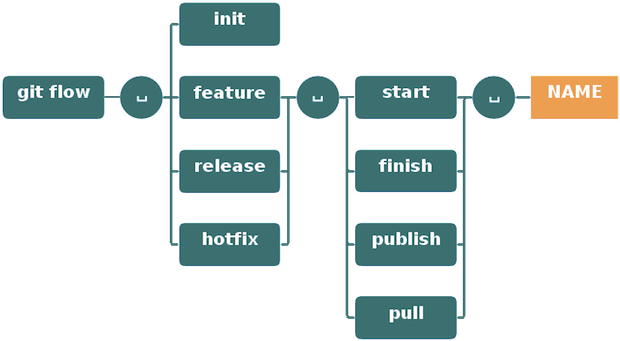
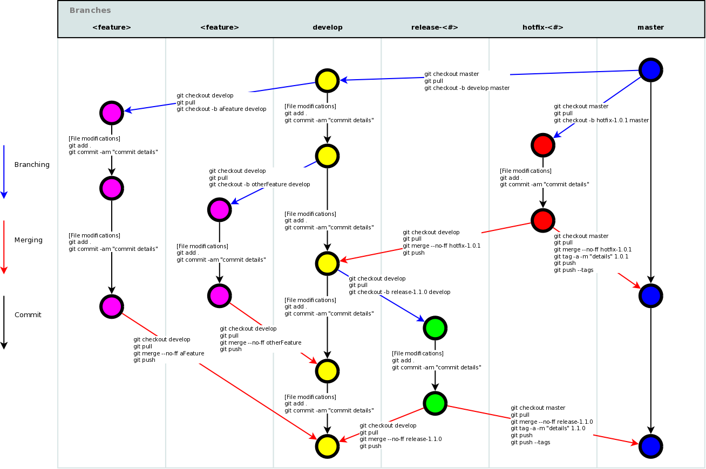

# Ściągawka z Git i Git Flow 
[](https://github.com/sindresorhus/awesome)

<p align="center">
    
</p>

---

## 📖 O przewodniku

Ta kompleksowa ściągawka z Git pomoże Ci opanować polecenia Git bez konieczności zapamiętywania wszystkiego. Niezależnie od tego, czy jesteś początkującym, czy doświadczonym programistą, ten przewodnik zapewnia szybki dostęp do najważniejszych operacji Git.

**Zapraszamy do współpracy!** Możesz:
- Poprawiać błędy gramatyczne
- Dodawać nowe polecenia
- Tłumaczyć na swój język
- Ulepszać wyjaśnienia

---
## 📋 Spis treści

- [🔧 Konfiguracja](#-konfiguracja)
- [⚙️ Pliki konfiguracyjne](#️-pliki-konfiguracyjne)
- [🆕 Tworzenie repozytorium](#-tworzenie-repozytorium)
- [📝 Zmiany lokalne](#-zmiany-lokalne)
- [🔍 Wyszukiwanie](#-wyszukiwanie)
- [📖 Historia commitów](#-historia-commitów)
- [📁 Przenoszenie / Zmiana nazwy](#-przenoszenie--zmiana-nazwy)
- [🌿 Gałęzie i tagi](#-gałęzie-i-tagi)
- [🔄 Aktualizacja i publikacja](#-aktualizacja-i-publikacja)
- [🔀 Scalanie i Rebase](#-scalanie-i-rebase)
- [↩️ Cofanie zmian](#️-cofanie-zmian)
- [🌊 Git Flow](#-git-flow)
- [🌍 Inne języki](#-inne-języki)

---

## 🔧 Konfiguracja

### Wyświetlanie konfiguracji

**Pokaż bieżącą konfigurację:**
```bash
git config --list
```

**Pokaż konfigurację repozytorium:**
```bash
git config --local --list
```

**Pokaż konfigurację globalną:**
```bash
git config --global --list
```

**Pokaż konfigurację systemową:**
```bash
git config --system --list
```

### Konfiguracja użytkownika

**Ustaw swoją nazwę dla historii wersji:**
```bash
git config --global user.name "[firstname lastname]"
```

**Ustaw swój adres email:**
```bash
git config --global user.email "[valid-email]"
```

### Ustawienia wyświetlania i edytora

**Włącz automatyczne kolorowanie wiersza poleceń:**
```bash
git config --global color.ui auto
```

**Ustaw globalny edytor dla commitów:**
```bash
git config --global core.editor vi
```

---

## ⚙️ Pliki konfiguracyjne

| Zakres | Lokalizacja | Flaga polecenia |
|--------|-------------|-----------------|
| **Repozytorium** | `<repo>/.git/config` | `--local` |
| **Użytkownik** | `~/.gitconfig` | `--global` |
| **System** | `/etc/gitconfig` | `--system` |

---

## 🆕 Tworzenie repozytorium

### Klonowanie istniejącego repozytorium

**Przez SSH:**
```bash
git clone ssh://user@domain.com/repo.git
```

**Przez HTTPS:**
```bash
git clone https://domain.com/user/repo.git
```

### Inicjalizacja nowego repozytorium

**Utwórz repozytorium w bieżącym katalogu:**
```bash
git init
```

**Utwórz repozytorium w określonym katalogu:**
```bash
git init <directory>
```

---

## 📝 Zmiany lokalne

### Sprawdzanie statusu i różnic

**Wyświetl status katalogu roboczego:**
```bash
git status
```

**Pokaż zmiany w śledzonych plikach:**
```bash
git diff
```

**Pokaż zmiany w określonym pliku:**
```bash
git diff <file>
```

### Dodawanie zmian do poczekalni

**Dodaj wszystkie bieżące zmiany:**
```bash
git add .
```

**Dodaj określone pliki:**
```bash
git add <filename1> <filename2>
```

**Interaktywnie dodaj części pliku:**
```bash
git add -p <file>
```

### Zatwierdzanie zmian

**Zatwierdź wszystkie zmiany w śledzonych plikach:**
```bash
git commit -a
```

**Zatwierdź zmiany z poczekalni:**
```bash
git commit
```

**Zatwierdź z wiadomością:**
```bash
git commit -m 'message here'
```

**Pomiń poczekalnię i zatwierdź z wiadomością:**
```bash
git commit -am 'message here'
```

**Zatwierdź z określoną datą:**
```bash
git commit --date="`date --date='n day ago'`" -am "<Commit Message Here>"
```

### Modyfikacja ostatniego commita

> ⚠️ **Uwaga:** Nie zmieniaj opublikowanych commitów!

**Zmień ostatni commit:**
```bash
git commit -a --amend
```

**Zmień bez modyfikacji wiadomości commita:**
```bash
git commit --amend --no-edit
```

**Zmień datę commita:**
```bash
GIT_COMMITTER_DATE="date" git commit --amend
```

**Zmień datę autora:**
```bash
git commit --amend --date="date"
```

### Schowek (Stash)

**Tymczasowo zapisz bieżące zmiany:**
```bash
git stash
```

**Zastosuj ostatnio schowane zmiany:**
```bash
git stash apply
```

**Zastosuj określony schowek:**
```bash
git stash apply stash@{stash_number}
```
> Użyj `git stash list`, aby zobaczyć dostępne schowki

**Usuń ostatni schowek:**
```bash
git stash drop
```

**Przenieś niezatwierdzone zmiany do innej gałęzi:**
```bash
git stash
git checkout branch2
git stash pop
```

---

## 🔍 Wyszukiwanie

### Wyszukiwanie tekstu

**Szukaj tekstu we wszystkich plikach:**
```bash
git grep "Hello"
```

**Szukaj w określonej wersji:**
```bash
git grep "Hello" v2.5
```

### Wyszukiwanie w commitach

**Znajdź commity wprowadzające określone słowo kluczowe:**
```bash
git log -S 'keyword'
```

**Szukaj za pomocą wyrażenia regularnego:**
```bash
git log -S 'keyword' --pickaxe-regex
```

---

## 📖 Historia commitów

### Podstawowa historia

**Pokaż wszystkie commity (szczegółowo):**
```bash
git log
```

**Pokaż commity (jedna linia każdy):**
```bash
git log --oneline
```

**Pokaż commity określonego autora:**
```bash
git log --author="username"
```

**Pokaż zmiany dla określonego pliku:**
```bash
git log -p <file>
```

### Zaawansowana historia

**Porównaj gałęzie:**
```bash
git log --oneline <origin/master>..<remote/master> --left-right
```

**Pokaż kto, co i kiedy zmienił:**
```bash
git blame <file>
```

### Logi referencyjne

**Pokaż log referencyjny:**
```bash
git reflog show
```

**Usuń log referencyjny:**
```bash
git reflog delete
```

---

## 📁 Przenoszenie / Zmiana nazwy

**Zmień nazwę pliku:**
```bash
git mv Index.txt Index.html
```

---

## 🌿 Gałęzie i tagi

### Lista gałęzi

**Lista lokalnych gałęzi:**
```bash
git branch
```

**Lista wszystkich gałęzi (lokalne + zdalne):**
```bash
git branch -a
```

**Lista zdalnych gałęzi:**
```bash
git branch -r
```

**Lista scalonych gałęzi:**
```bash
git branch --merged
```

### Przełączanie i tworzenie gałęzi

**Przełącz na istniejącą gałąź:**
```bash
git checkout <branch>
```

**Utwórz i przełącz na nową gałąź:**
```bash
git checkout -b <branch>
```

**Przełącz na poprzednią gałąź:**
```bash
git checkout -
```

**Utwórz gałąź z istniejącej gałęzi:**
```bash
git checkout -b <new_branch> <existing_branch>
```

**Utwórz gałąź z określonego commita:**
```bash
git checkout <commit-hash> -b <new_branch_name>
```

**Utwórz gałąź bez przełączania:**
```bash
git branch <new-branch>
```

**Utwórz gałąź śledzącą:**
```bash
git branch --track <new-branch> <remote-branch>
```

### Operacje na gałęziach

**Pobierz pojedynczy plik z innej gałęzi:**
```bash
git checkout <branch> -- <filename>
```

**Zastosuj określony commit z innej gałęzi:**
```bash
git cherry-pick <commit hash>
```

**Zmień nazwę bieżącej gałęzi:**
```bash
git branch -m <new_branch_name>
```

**Usuń lokalną gałąź:**
```bash
git branch -d <branch>
```

**Wymuś usunięcie lokalnej gałęzi:**
```bash
git branch -D <branch>
```
> ⚠️ **Uwaga:** Utracisz niescalone zmiany!

### Tagi

**Utwórz tag na HEAD:**
```bash
git tag <tag-name>
```

**Utwórz tag z adnotacją:**
```bash
git tag -a <tag-name>
```

**Utwórz tag z wiadomością:**
```bash
git tag <tag-name> -am 'message here'
```

**Lista wszystkich tagów:**
```bash
git tag
```

**Lista tagów z wiadomościami:**
```bash
git tag -n
```

---

## 🔄 Aktualizacja i publikacja

### Zarządzanie zdalnymi repozytoriami

**Lista skonfigurowanych zdalnych repozytoriów:**
```bash
git remote -v
```

**Pokaż informacje o zdalnym repozytorium:**
```bash
git remote show <remote>
```

**Dodaj nowe zdalne repozytorium:**
```bash
git remote add <remote> <url>
```

**Zmień nazwę zdalnego repozytorium:**
```bash
git remote rename <remote> <new_remote>
```

**Usuń zdalne repozytorium:**
```bash
git remote rm <remote>
```
> ℹ️ **Uwaga:** To usuwa tylko lokalne odwołanie do zdalnego repozytorium, nie samo zdalne repozytorium.

### Pobieranie zmian

**Pobierz zmiany bez scalania:**
```bash
git fetch <remote>
```

**Pobierz i scal zmiany:**
```bash
git pull <remote> <branch>
```

**Pobierz zmiany z głównej gałęzi:**
```bash
git pull origin master
```

**Pobierz z rebase:**
```bash
git pull --rebase <remote> <branch>
```

### Wysyłanie i publikacja

**Opublikuj lokalne zmiany:**
```bash
git push <remote> <branch>
```

**Usuń zdalną gałąź:**
```bash
# Git v1.7.0+
git push <remote> --delete <branch>

# Git v1.5.0+
git push <remote> :<branch>
```

**Opublikuj tagi:**
```bash
git push --tags
```

---

## 🔀 Scalanie i Rebase

### Operacje scalania

**Scal gałąź do bieżącego HEAD:**
```bash
git merge <branch>
```

**Skonfiguruj narzędzie do scalania globalnie:**
```bash
git config --global merge.tool meld
```

**Użyj skonfigurowanego narzędzia do scalania:**
```bash
git mergetool
```

### Operacje rebase

> ⚠️ **Uwaga:** Nie wykonuj rebase na opublikowanych commitach!

**Rebase bieżącego HEAD na gałąź:**
```bash
git rebase <branch>
```

**Przerwij rebase:**
```bash
git rebase --abort
```

**Kontynuuj rebase po rozwiązaniu konfliktów:**
```bash
git rebase --continue
```

### Rozwiązywanie konfliktów

**Oznacz plik jako rozwiązany:**
```bash
git add <resolved-file>
```

**Usuń rozwiązany plik:**
```bash
git rm <resolved-file>
```

### Squashowanie commitów

**Interaktywny rebase do squashowania:**
```bash
git rebase -i <commit-just-before-first>
```

**Przykładowa konfiguracja squash:**
```
# Przed
pick <commit_id>
pick <commit_id2>
pick <commit_id3>

# Po (squash commit_id2 i commit_id3 do commit_id)
pick <commit_id>
squash <commit_id2>
squash <commit_id3>
```

---

## ↩️ Cofanie zmian

### Odrzucanie zmian

**Odrzuć wszystkie lokalne zmiany:**
```bash
git reset --hard HEAD
```

**Usuń wszystkie pliki z poczekalni:**
```bash
git reset HEAD
```

**Odrzuć zmiany w określonym pliku:**
```bash
git checkout HEAD <file>
```

### Operacje resetowania

**Resetuj do poprzedniego commita (odrzuć wszystkie zmiany):**
```bash
git reset --hard <commit>
```

**Resetuj do stanu zdalnej gałęzi:**
```bash
git reset --hard <remote/branch>
# Przykład: git reset --hard upstream/master
```

**Resetuj zachowując zmiany jako niestageowane:**
```bash
git reset <commit>
```

**Resetuj zachowując niezatwierdzone lokalne zmiany:**
```bash
git reset --keep <commit>
```

### Cofanie commitów

**Cofnij commit (utwórz nowy commit z odwrotnymi zmianami):**
```bash
git revert <commit>
```

### Czyszczenie ignorowanych plików

**Usuń przypadkowo zatwierdzone pliki, które powinny być ignorowane:**
```bash
git rm -r --cached .
git add .
git commit -m "remove ignored files"
```

---

## 🌊 Git Flow

**Ulepszony Git-flow:** [git-flow-avh](https://github.com/petervanderdoes/gitflow-avh)

### 📋 Spis treści
- [🔧 Instalacja](#instalacja)
- [🚀 Rozpoczęcie pracy](#rozpoczęcie-pracy)
- [✨ Funkcjonalności](#funkcjonalności)
- [🎁 Tworzenie wydania](#tworzenie-wydania)
- [🔥 Hotfixy](#hotfixy)
- [📊 Przegląd poleceń](#przegląd-poleceń)

---

### 🔧 Instalacja {#instalacja}

> **Wymaganie wstępne:** Wymagana działająca instalacja Git. Git-flow działa na macOS, Linux i Windows.

**macOS (Homebrew):**
```bash
brew install git-flow-avh
```

**macOS (MacPorts):**
```bash
port install git-flow
```

**Linux (dystrybucje oparte na Debianie):**
```bash
sudo apt-get install git-flow
```

**Windows (Cygwin):**
> Wymaga wget i util-linux
```bash
wget -q -O - --no-check-certificate https://raw.githubusercontent.com/petervanderdoes/gitflow/develop/contrib/gitflow-installer.sh install <state> | bash
```

---

### 🚀 Rozpoczęcie pracy

Git-flow wymaga inicjalizacji w celu dostosowania konfiguracji projektu.

**Inicjalizacja (interaktywna):**
```bash
git flow init
```
> Odpowiesz na pytania dotyczące konwencji nazewnictwa gałęzi. Zalecane są wartości domyślne.

**Inicjalizacja (użyj domyślnych):**
```bash
git flow init -d
```

---

### ✨ Funkcjonalności

Funkcjonalności służą do rozwijania nowych możliwości dla przyszłych wydań. Zazwyczaj istnieją tylko w repozytoriach deweloperów.

**Rozpocznij nową funkcjonalność:**
```bash
git flow feature start MYFEATURE
```
> Tworzy gałąź funkcjonalności opartą na 'develop' i przełącza na nią

**Zakończ funkcjonalność:**
```bash
git flow feature finish MYFEATURE
```
> Spowoduje to:
> 1. Scalenie MYFEATURE do 'develop'
> 2. Usunięcie gałęzi funkcjonalności
> 3. Przełączenie z powrotem na 'develop'

**Opublikuj funkcjonalność (do współpracy):**
```bash
git flow feature publish MYFEATURE
```

**Pobierz opublikowaną funkcjonalność:**
```bash
git flow feature pull origin MYFEATURE
```

**Śledź funkcjonalność z origin:**
```bash
git flow feature track MYFEATURE
```

---

### 🎁 Tworzenie wydania

Wydania wspierają przygotowanie nowych wersji produkcyjnych, umożliwiając drobne poprawki błędów i przygotowanie metadanych.

**Rozpocznij wydanie:**
```bash
git flow release start RELEASE [BASE]
```
> Tworzy gałąź wydania z 'develop'. Opcjonalnie podaj [BASE] — SHA-1 commita.

**Opublikuj wydanie:**
```bash
git flow release publish RELEASE
```

**Śledź zdalne wydanie:**
```bash
git flow release track RELEASE
```

**Zakończ wydanie:**
```bash
git flow release finish RELEASE
```
> Spowoduje to:
> 1. Scalenie gałęzi wydania do 'master'
> 2. Otagowanie wydania
> 3. Scalenie wydania z powrotem do 'develop'
> 4. Usunięcie gałęzi wydania

> 💡 **Nie zapomnij:** Wypchnij tagi poleceniem `git push --tags`

---

### 🔥 Hotfixy

Hotfixy służą do naprawy krytycznych problemów w wersji produkcyjnej. Rozgałęziają się od odpowiedniego tagu na masterze.

**Rozpocznij hotfix:**
```bash
git flow hotfix start VERSION [BASENAME]
```

**Zakończ hotfix:**
```bash
git flow hotfix finish VERSION
```
> Scala z powrotem do 'develop' i 'master' oraz taguje scalenie z masterem

---

### 📊 Przegląd poleceń

<p align="center">
    
</p>

### 🌊 Schemat Git Flow

<p align="center">
    
</p>

---


## 🌍 Inne języki

Ta ściągawka jest dostępna w wielu językach:

| Język | Link |
|-------|------|
| 🇸🇦 Arabski | [git-cheat-sheet-ar.md](git-cheat-sheet-ar.md) |
| 🇧🇩 Bengalski | [git-cheat-sheet-bn.md](git-cheat-sheet-bn.md) |
| 🇧🇷 Portugalski (Brazylia) | [git-cheat-sheet-pt_BR.md](git-cheat-sheet-pt_BR.md) |
| 🇨🇳 Chiński | [git-cheat-sheet-zh.md](git-cheat-sheet-zh.md) |
| 🇩🇪 Niemiecki | [git-cheat-sheet-de.md](git-cheat-sheet-de.md) |
| 🇬🇷 Grecki | [git-cheat-sheet-el.md](git-cheat-sheet-el.md) |
| 🇮🇳 Hindi | [git-cheat-sheet-hi.md](git-cheat-sheet-hi.md) |
| 🇰🇷 Koreański | [git-cheat-sheet-ko.md](git-cheat-sheet-ko.md) |
| 🇵🇱 **Polski** | **(bieżący)** |
| 🇪🇸 Hiszpański | [git-cheat-sheet-es.md](git-cheat-sheet-es.md) |
| 🇹🇷 Turecki | [git-cheat-sheet-tr.md](git-cheat-sheet-tr.md) |
| 🇺🇸 Angielski | [README.md](../README.md) |

---

## 🤝 Współpraca

Zapraszamy do współpracy! Możesz:

- 🐛 Zgłaszać błędy lub literówki
- ✨ Dodawać nowe polecenia Git
- 🌍 Tłumaczyć na nowe języki
- 💡 Ulepszać wyjaśnienia
- 📝 Poprawiać formatowanie

**Jak współpracować:**
1. Zrób fork tego repozytorium
2. Utwórz swoją gałąź funkcjonalności (`git checkout -b feature/AmazingFeature`)
3. Zatwierdź swoje zmiany (`git commit -m 'Add some AmazingFeature'`)
4. Wypchnij gałąź (`git push origin feature/AmazingFeature`)
5. Otwórz Pull Request

---

## 📄 Licencja

Ten projekt jest open source i dostępny na [licencji MIT](../LICENSE).

---

<p align="center">
    <b>⭐ Zostaw gwiazdkę, jeśli ten przewodnik był pomocny!</b>
</p>
